# Floracat Diagram

## 简介

Floracat Diagram 是一款面向 AI 编程助手的图表生成技能，能够根据自然语言描述自动生成 Mermaid、PlantUML 等主流图表语法的代码，并输出为可渲染的文本文件（`.mmd` / `.puml`）或直接导出 PNG/SVG/PDF 等格式。

传统图表工具需要手动拖拽、对齐，耗时且容易与代码脱节。Floracat Diagram 的核心理念是 **"图表即代码"（Diagram as Code）**——用纯文本描述结构，让 AI 完成语法编写与验证，图表与文档一起纳入版本管理，随代码同步演进。

核心能力：

- 自然语言 → Mermaid / PlantUML 代码，无需记忆语法细节
- 内置语法验证循环，生成后自动检查并修复错误
- 支持 20+ 种图表类型，覆盖架构、流程、时序、状态等常见场景
- 导出 PNG / SVG / PDF，可直接嵌入文档或 PR

## 支持的图表类型

### Mermaid 图表

| 图表类型 | 关键字 | 典型用途 |
|---|---|---|
| 流程图 | `flowchart` | 业务流程、决策逻辑、算法步骤 |
| 时序图 | `sequenceDiagram` | API 调用链、服务交互、协议流程 |
| 类图 | `classDiagram` | OOP 类结构、领域模型 |
| 状态图 | `stateDiagram-v2` | 状态机、订单生命周期、工作流 |
| ER 图 | `erDiagram` | 数据库表关系、领域实体 |
| 甘特图 | `gantt` | 项目排期、里程碑规划 |
| 饼图 | `pie` | 占比分析、资源分配 |
| 思维导图 | `mindmap` | 知识梳理、头脑风暴 |
| 用户旅程 | `journey` | 用户体验路径、客户旅程 |
| Git 图 | `gitGraph` | 分支策略可视化 |
| C4 架构 | `C4Context` / `C4Container` | 系统架构分层 |
| 需求图 | `requirementDiagram` | 需求追踪与关系 |
| 时间线 | `timeline` | 事件时序排列 |
| 象限图 | `quadrantChart` | 优先级矩阵 |

### PlantUML 图表

| 图表类型 | 关键字 | 典型用途 |
|---|---|---|
| 时序图 | `@startuml` + 参与者与消息 | 复杂服务交互、协议细节 |
| 类图 | `class` | 精细的 UML 类建模、泛化与组合 |
| 状态图 | `state` | 状态机、订单/审批流程 |
| 用例图 | `actor` / `usecase` | 系统边界与角色交互 |
| 活动图 | `start` / `stop` / `if` | 业务流程、审批流 |
| 组件图 | `component` | 系统模块依赖 |
| 部署图 | `node` | 基础设施拓扑 |
| 对象图 | `object` | 运行时对象快照 |
| ER 图 | `entity` | 数据库建模（高级语法） |
| 甘特图 | `@startgantt` | 项目排期 |
| 思维导图 | `@startmindmap` | 知识结构 |
| 网络图 | `@startjson` / `@startyaml` | JSON/YAML 数据可视化 |
| Wireframe | `@startsalt` | UI 线框图 |
| Archimate | `@startarchimate` | 企业架构建模 |

## 安装与使用

### 安装

```bash
npx skills add floracat/diagram --skill floracat-diagram
```

安装后，技能文件会写入 `.claude/skills/` 或 `.agents/skills/` 目录，Claude Code、OpenCode 等兼容代理会自动加载。

### 基本用法

在对话中直接用自然语言描述你需要什么图表：

```
帮我画一个用户登录的时序图，包含客户端、API 网关、认证服务和数据库
```

Floracat Diagram 会自动完成以下步骤：

1. **识别图表类型** — 根据描述推断最合适的图表种类
2. **生成代码** — 编写符合语法的 Mermaid 或 PlantUML 源码
3. **验证语法** — 使用 `mmdc`（Mermaid CLI）或 Kroki 验证，发现错误自动修复并重新验证
4. **导出文件** — 输出 `.mmd` / `.puml` 源文件及 PNG/SVG/PDF 渲染结果

### 指定输出格式

```
用 Mermaid 画一个微服务架构的 C4 Container 图
```

```
用 PlantUML 画一个类图，展示用户、订单、商品的继承和关联关系
```

### 导出图片

```bash
# Mermaid 导出
mmdc -i diagram.mmd -o diagram.png
mmdc -i diagram.mmd -o diagram.svg

# PlantUML 导出（需要 Java + Graphviz）
java -jar plantuml.jar diagram.puml
```

## Mermaid 语法示例

### 流程图（Flowchart）

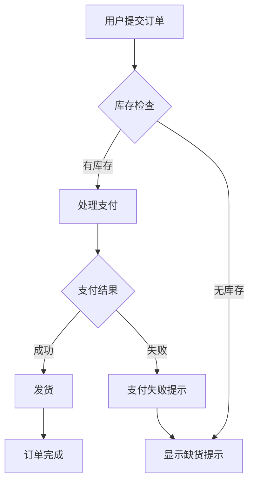

关键语法说明：

- `flowchart TD` — 自上而下布局，`LR` 为从左到右
- `A[矩形]` — 方框节点
- `B{菱形}` — 判断节点
- `C(圆角)` — 圆角矩形
- `A -->|标签| B` — 带标签的连线
- `A -.-> B` — 虚线箭头

### 时序图（Sequence Diagram）

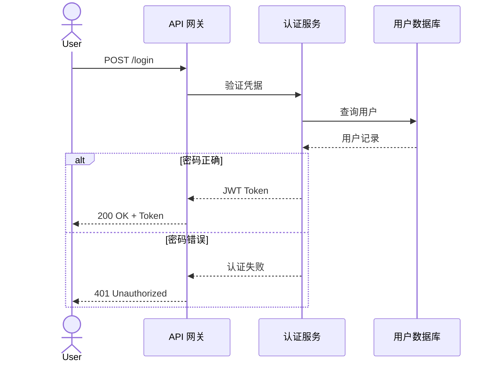

关键语法说明：

- `actor` — 人物角色（小人图标）
- `participant` — 参与者（方框）
- `->>` — 实线请求箭头
- `-->>` — 虚线响应箭头
- `alt / else / end` — 条件分支
- `loop ... end` — 循环块
- `activate / deactivate` — 激活条

### 类图（Class Diagram）

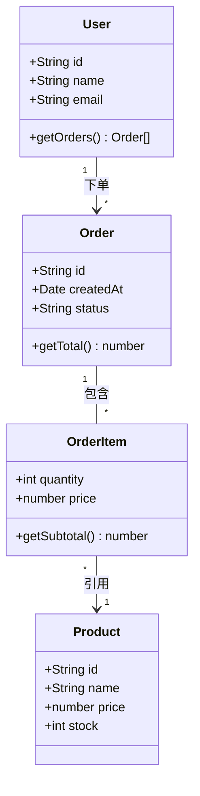

关键语法说明：

- `+` 公开、`-` 私有、`#` 受保护
- `<|--` 继承（泛化）
- `-->` 关联
- `o--` 聚合
- `*--` 组合
- `..>` 依赖

### 状态图（State Diagram）

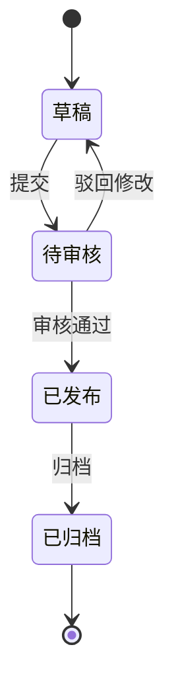

### ER 图（Entity Relationship Diagram）

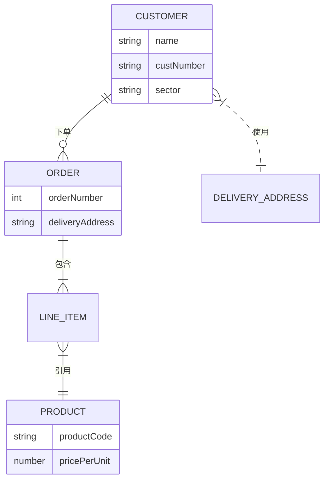

关键语法说明：

- `||--||` 一对一
- `||--o{` 一对多
- `}|--||` 多对一
- `}|--o{` 多对多

### 甘特图（Gantt Chart）

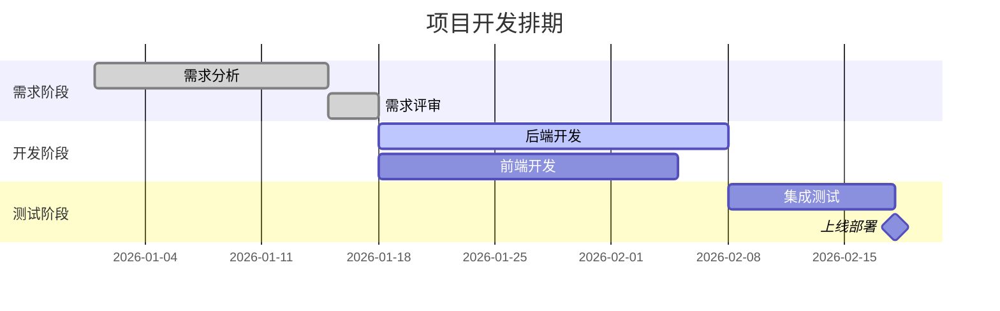

### 饼图（Pie Chart）

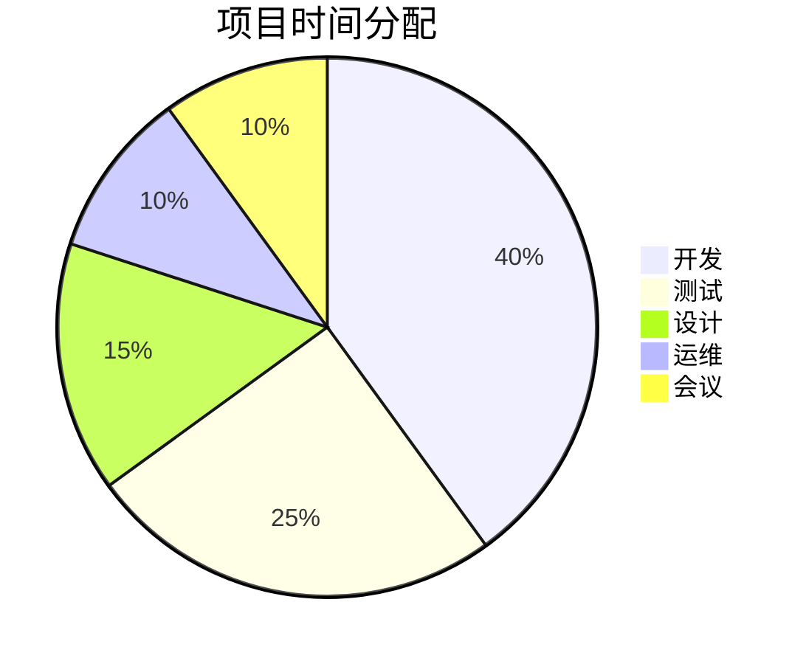

### 思维导图（Mindmap）

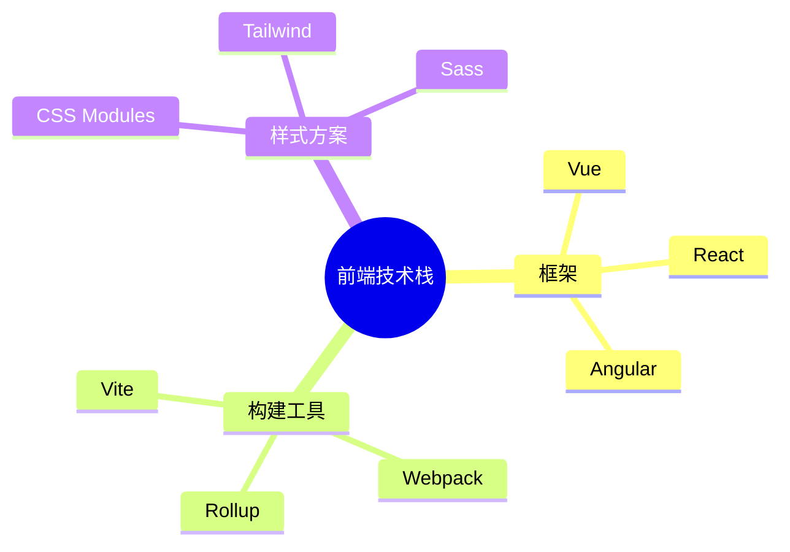

### 用户旅程图（User Journey）

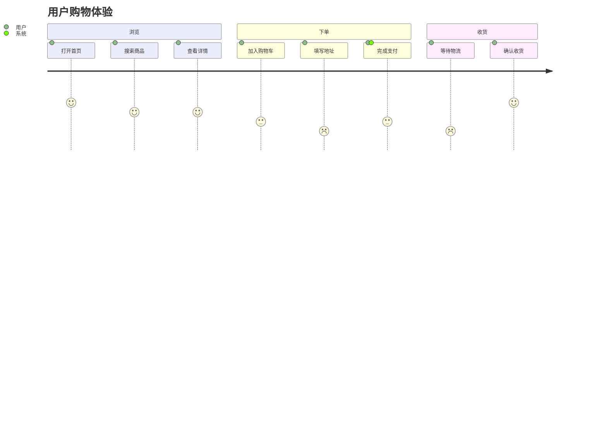

## PlantUML 语法示例

### 时序图

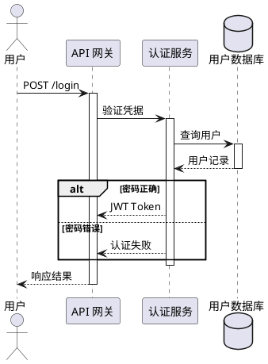

PlantUML 时序图优势：

- 支持 `activate` / `deactivate` 激活条嵌套
- 支持 `alt` / `opt` / `loop` / `par` / `critical` 等复杂组合片段
- 支持自消息、延迟、备注等精细控制
- 30+ 消息的复杂交互仍可保持清晰布局

### 类图

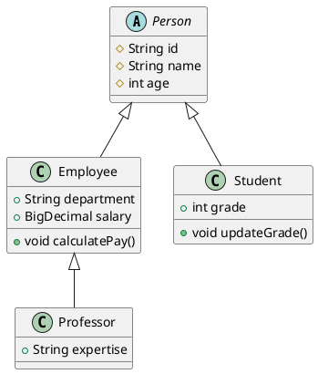

### 状态图

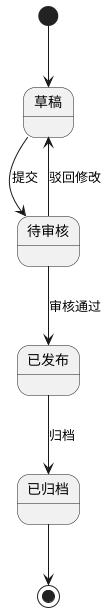

### 活动图

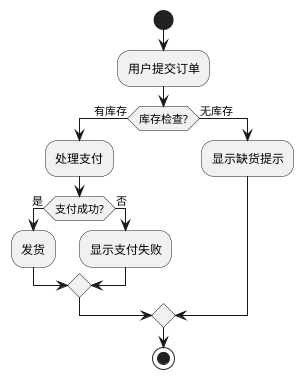

### 组件图

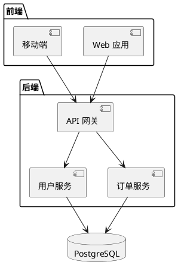

## 提示词技巧

### 明确图表类型

不好的提示：

```
画一个系统交互图
```

好的提示：

```
用 Mermaid 时序图画一个用户登录的交互流程，包含客户端、API 网关、认证服务和数据库，展示正常登录和密码错误的失败路径
```

### 提供足够的结构信息

```
画一个电商系统的类图，包含以下实体：
- 用户（id, name, email）
- 订单（id, status, totalAmount）
- 商品（id, name, price, stock）
- 订单项（quantity, unitPrice）
关系：用户 1 对多 订单，订单 1 对多 订单项，订单项 多对 1 商品
```

明确列出实体、字段和关系，AI 生成的代码准确度会大幅提升。

### 指定布局方向

```
画一个从左到右的微服务调用链路流程图
```

- 流程图默认 `TD`（上→下），加 `LR` 可改为左→右
- 时序图默认水平排列参与者，无需指定方向

### 分步迭代

复杂图表建议分步生成：

1. 先生成核心结构
2. 再补充细节（注释、样式、子图）
3. 最后验证和微调

```
先帮我画一个简化的微服务架构图，只包含核心服务，然后再逐步补充缓存层和消息队列
```

### 善用子图分组

```
画一个系统架构图，用子图将前端层、服务层和数据层分别分组
```

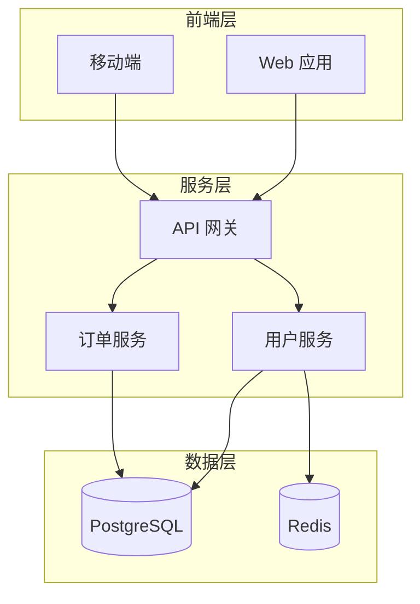

### Mermaid 与 PlantUML 选择指南

| 场景 | 推荐格式 | 原因 |
|---|---|---|
| GitHub / GitLab README | Mermaid | 原生渲染，无需额外工具 |
| 简单流程图（<15 节点） | Mermaid | 语法简洁，上手快 |
| 复杂时序图（30+ 消息） | PlantUML | 嵌套激活、组合片段更完善 |
| 精细类图（可见性、模板） | PlantUML | 支持更多 UML 细节 |
| CI/CD 自动生成 | PlantUML | Graphviz 后端布局更稳定 |
| 快速原型 / 对话中预览 | Mermaid | 大多数 AI 模型对 Mermaid 语法掌握更好 |

## 最佳实践

### 1. 图表即代码，纳入版本管理

将 `.mmd` 和 `.puml` 文件提交到 Git 仓库，与代码同步演进。这样图表的变更历史可追溯，Code Review 时也能审查图表变更。

### 2. 控制图表复杂度

单张图表建议不超过 15-20 个节点。超过此范围时：

- 拆分为多张子图，用超链接关联
- 使用子图（`subgraph`）分组
- 抽象细节，只展示核心交互

### 3. 使用一致的命名风格

- 节点 ID 用英文简写（`A`、`Auth`、`DB`）
- 显示标签用中文或业务术语
- 连线标签简短明确

### 4. 善用 Mermaid Live Editor 预览

在线编辑器 https://mermaid.live 可以实时预览 Mermaid 图表，调试语法时非常方便。

### 5. PlantUML 使用 `skinparam` 统一样式

```plantuml
@startuml
skinparam backgroundColor #FEFEFE
skinparam shadowing false
skinparam defaultFontSize 12
skinparam classAttributeIconSize 0
@enduml
```

### 6. 验证后再提交

Floracat Diagram 内置验证循环，但手动场景下也应验证：

```bash
# Mermaid 语法验证
mmdc -i diagram.mmd -o /dev/null

# PlantUML 语法验证
java -jar plantuml.jar -syntax diagram.puml
```

### 7. 在 Markdown 中嵌入

GitHub 原生支持 Mermaid 代码块渲染：

````markdown

````

PlantUML 需要通过外部服务渲染图片后嵌入：

```markdown

```

## 常见问题

### Q: Mermaid 图表渲染报错 "Parse error" 怎么办？

最常见的语法错误：

1. **箭头语法错误** — 时序图中请求用 `->>` 而非 `->`，响应用 `-->>`
2. **类图中多余分号** — Mermaid 类图属性后不需要分号
3. **特殊字符未转义** — 节点标签含 `()` `{}` `[]` 等字符时需用引号包裹：`A["包含(特殊)字符"]`
4. **节点 ID 重复** — 同一图表中节点 ID 必须唯一

### Q: 图表太大，布局混乱怎么办？

- 流程图切换方向：`flowchart LR`（横向）替代 `TD`（纵向）
- 使用 `subgraph` 将相关节点分组
- 拆分为多张图表
- PlantUML 使用 `left to right direction` 或 `top to bottom direction` 控制方向

### Q: PlantUML 需要安装什么？

PlantUML 依赖 Java 运行时和 Graphviz：

```bash
# 安装 Java
sudo apt install default-jre    # Ubuntu/Debian
brew install java               # macOS

# 安装 Graphviz
sudo apt install graphviz       # Ubuntu/Debian
brew install graphviz           # macOS

# 下载 PlantUML jar
wget https://github.com/plantuml/plantuml/releases/download/v1.2024.8/plantuml-1.2024.8.jar
```

也可以使用在线服务器 https://www.plantuml.com/plantuml 避免本地安装。

### Q: Mermaid 和 PlantUML 能否混用？

不建议在同一项目中混用。选择一种格式保持一致性：

- 如果团队文档主要在 GitHub/GitLab 上，选 Mermaid
- 如果需要更精细的 UML 控制或 CI 自动生成，选 PlantUML

### Q: AI 生成的图表语法有错误怎么修复？

Floracat Diagram 内置验证循环会自动修复，手动修复时注意：

1. 将代码粘贴到 Mermaid Live Editor（https://mermaid.live）或 PlantUML 在线编辑器（https://www.plantuml.com/plantuml）
2. 根据错误提示定位行号
3. 参考上文"常见语法错误"对照修复
4. 修复后重新验证

### Q: 如何在 CI/CD 中自动生成图表？

```yaml
# GitHub Actions 示例
- name: Install Mermaid CLI
  run: npm install -g @mermaid-js/mermaid-cli

- name: Generate diagrams
  run: |
    for f in docs/diagrams/*.mmd; do
      mmdc -i "$f" -o "${f%.mmd}.png"
    done

- name: Commit diagrams
  run: |
    git add docs/diagrams/*.png
    git commit -m "chore: regenerate diagrams"
```

### Q: 导出的图片模糊怎么办？

- Mermaid：使用 SVG 格式导出（`mmdc -i diagram.mmd -o diagram.svg`），矢量图在任何分辨率下都清晰
- PlantUML：使用 `-tsvg` 参数导出 SVG，或在 `@startuml` 后添加 `skinparam dpi 300` 提高位图分辨率
